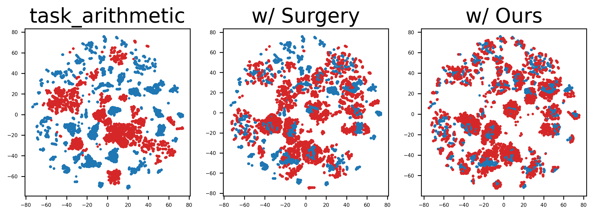
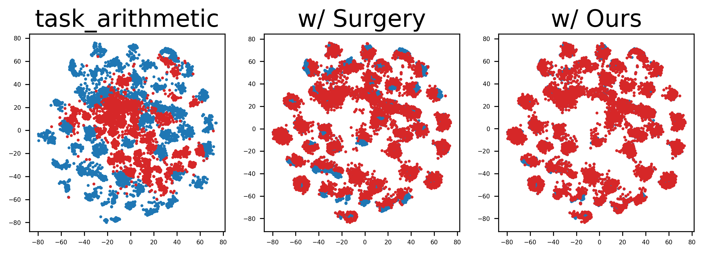
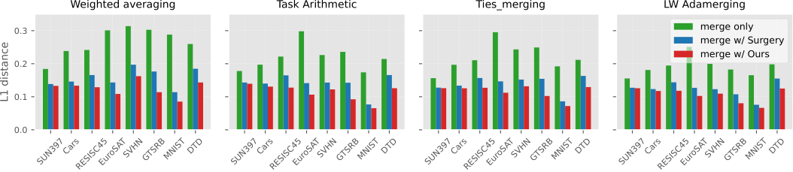

# ProbSurgery

Our paper "**Representation Surgery in Model Merging with Probabilistic Modeling**" was accepted by the 42nd International Conference on Machine Learning (**ICML 2025**). Thanks to all collaborators!

### Abstract
> Model merging aims to achieve multitask performance by merging multiple expert models without the need to access the raw training data. Recent research identified the representation bias of model merging, characterized by a discrepancy in the representation distribution between the merged and individual models, hindering the performance of model merging methods. To mitigate this bias, a task-specific MLP, Surgery, was built to model the bias that is subsequently decreased on the merged representation. However, this strategy is still suboptimal due to the limited modeling capability within the deterministic manner. To address this issue, we present ProbSurgery, a probabilistic module specifically designed to accurately model the representation bias. This module generates an embedding distribution for each sample and outputs the representation bias through a sampling process. ProbSurgery offers superior representational capacity by naturally handling the uncertainty resulting from parameter interference of merging multiple models.  Besides, we provide a theoretical analysis to reveal the advance of the probabilistic manner and propose an extension of ProSurgery for adapting to the task-sharing setting. Extensive experiments verify the effectiveness of ProbSurgery for representation surgery while maintaining generalization capabilities in real-world scenarios.

### Performance

> Visualization: Better representation. (Left: GTSRB, Right: RESISC45)

  
  

> Fewer discrepancy in the representation distribution between the merged and individual models

  

# Run Our Code
Our code is built upon the pytorch implementation of <a href="https://github.com/EnnengYang/RepresentationSurgery" target="_blank">Surgery</a>.

*Note: We modified the training procedure in Surgery by pre-loading many batches first and then training our ProbSurgery modules, which could fasts the training processes for a large degree. The number of pre-loaded batches is dependent on the capibility of your machine (**not GPU memory but the number of threads supported by the CPU**).*

### Python Environment
See the file: "_**environment.yaml**_"
You can rebuild this python environment in you machine via this cammond. 
<pre> conda env create -f environment.yaml </pre>

### Step 1: Dataset and checkpoint preparetion
We keep the same setting with almost all model merging methods (like ties merging, task arithmetic, and Surgery).

**1. Download checkpoints for CLIP** (ViT-B/32, ViT-B/16 and ViT-L/14) are available on this link, including fine-tuned checkpoints on eight downstream tasks: Stanford Cars, DTD, EuroSAT, GTSRB, MNIST, RESISC45, SUN397 and SVHN.
<a href="https://drive.google.com/drive/folders/1u_Tva6x0p6oxu5Eo0ZZsf-520Cc_3MKw" target="_blank">Model Checkpoints</a>.

*Note: When using torch.load(xxx_checkpoint).state_dict() fails, you can try pickle.load(open(xxx_checkpoint, 'rb')).state_dict()*

**2. Download datasets**
See the links provided in "**_data_link.txt_**"

### Step 2: Train and Evaluation
After download the model CKPT and dataset, set their default path in the file "_**MainCode/run/path_config.py**_"

"cd the MainCode" and Run:

<pre>python run.py </pre>
